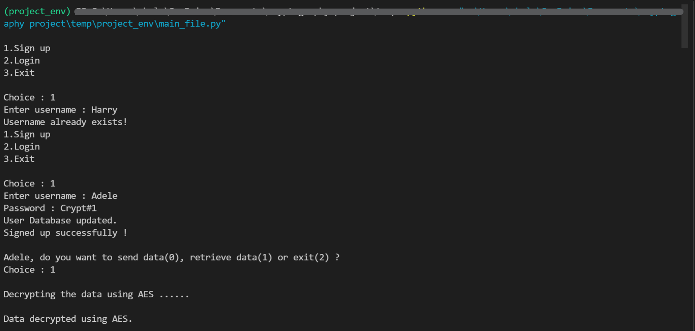
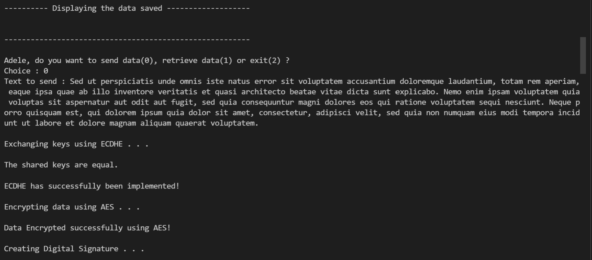
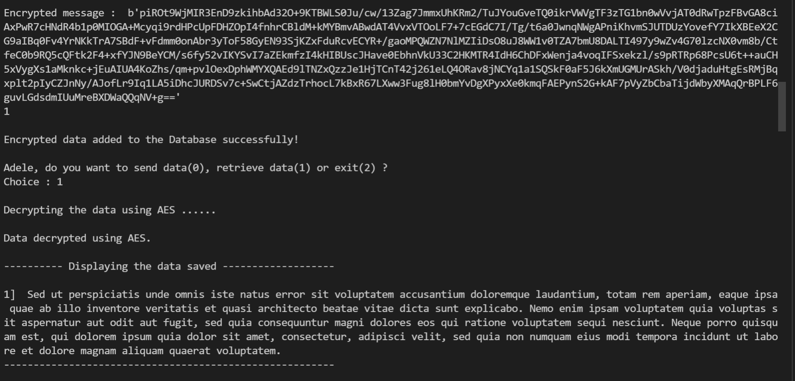
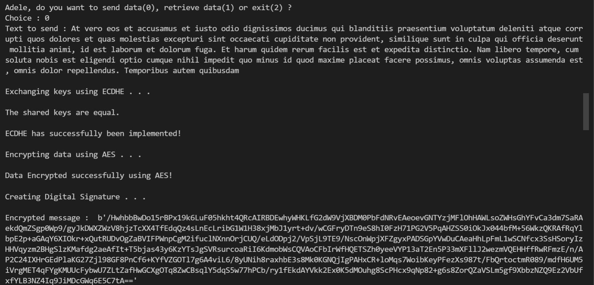
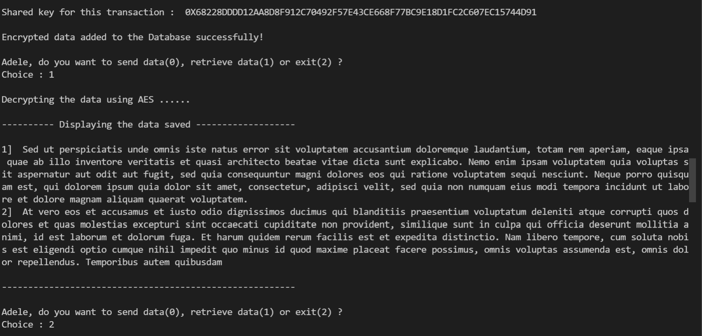
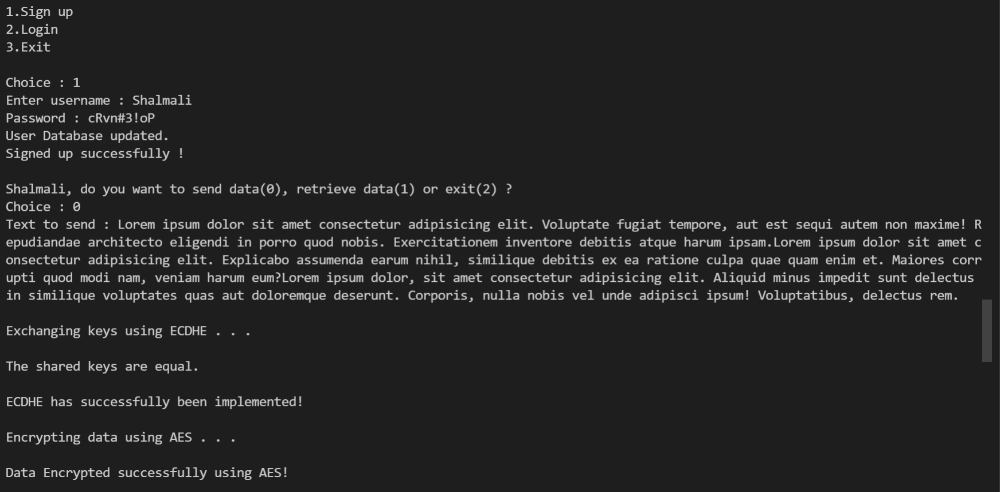
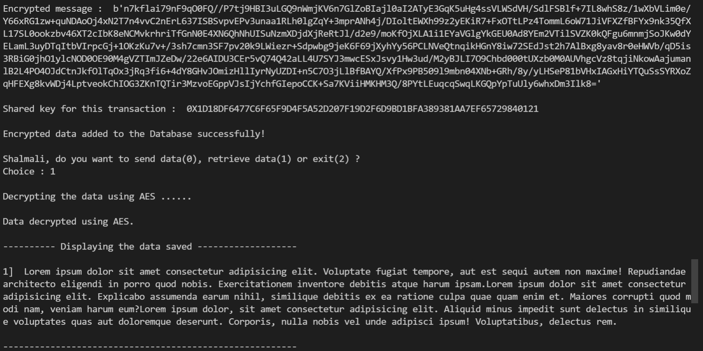
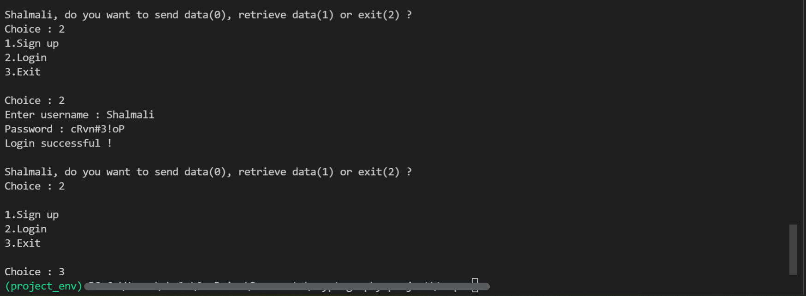
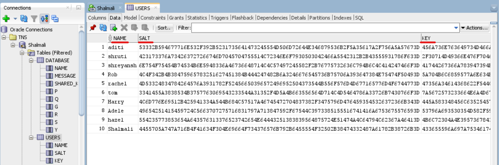
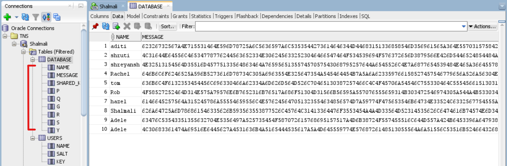

# Secure transmission storage and retrieval of data in a multi user data base using cryptographic Algorithm

Data has become one of the most important commodities in recent times and thus the need to secure it has become a necessity. When data is being sent or retrieved over a public channel it may be intercepted and read by an eavesdropper or the altered altogether (Man in the middle attack).

To prevent such attacks, this work aims to provide a method for secure data transmission and storage system using AES-128 encryption mechanism to encrypt and decrypt user data, Elliptical Curve Diffie Hellman Ephemeral as the primary key sharing algorithm, SHA-256 hashing mechanism, and verify the digital signature without the interference of any third person.

 ## Cryptographic algorithms used - 
 ### 1. ECDHE - Elliptic curve Diffie Hellman Ephermal for key exchange - 
 Elliptic curve Diffie-Hellman (ECDH) is an anonymous key exchange and agreement algorithm that allows two parties, each having an elliptic curve public-private key pair, to establish a shared secret over an insecure channel.
 ### ECDH algorithm has been proven to successfully prevent MITM attacks -
 As for the MITM finding the point lies in solving the discrete logarithm problem which is computationally impossible to do so. 
 The novelty of ECDHE is that a distinct key is used for every exchange.
 
 ### 2. AES 128 CBC - Advanced Encryption System - 
 AES functions by the use of a symmetric algorithm and with a base key size of 128 bits has still proven to be safe against brute force attack and even a super computer would require a billion years to crack AES-128 encryption.
 
 ### 3. SHA - 256 - Secured Hashing Algorithm -  
 It one of the strongest one-way hash functions used to convert a variable size input to a condensed fixed-size bit string output. 
 
 ### 4. Digital Signature Algorithm - 
 To authenticate the identity of the source messages and for non-repudiation.
 A Digital signature is created at the time of sending the text and is verified at the time of retrieval of the data.
 
 ## Defense against rainbow tables -
 A rainbow table is a precomputed table for caching the output of cryptographic hash functions, usually for cracking password hashes but it is ineffective against one-way hashes that include large salts.
 To provide extra security to the passwords of the users that are being stored by providing a unique hash per password.
 
 
 ## Sample Input/Output - 
 ### Terminal Window - 
 
 
 
 
 
 
 
 
 ### Database for Users- 
 
 
 ### Database for Messages - 
  
 
